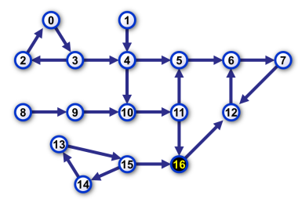

# Conveyor Reconfigurations
  The chemical factory, in this problem, consists of processing points and conveyors. For simplicity, the processing points are called just points, throughout this text. Each conveyor connects two points, there may be more conveyors connected to a node.
  In a point, a chemical is processed, and then, depending on a production process, it can be moved to another point for additional processing. Only the conveyors are used for movement of the chemicals.
  
  Some of the points have an additional function as dedicated source points where chemicals are stocked during the day. The factory is organized in such way that whenever a chemical is needed in a particular point, there is at least one source point from which the chemical can be transported via one or more conveyors to that particular point. One of the points, not necessarily a source point, serves as so-called central store. Each morning, each of the source points receives one package of chemicals which is transported to the source point from the central store. The package contains all chemicals used in the factory.
  
  Transporting the packages from the central store to the source points is a demanding process. Each of the conveyors is optimized for movement in only one preferred direction. In order for the packages to reach the source points, some of the conveyors have to be reconfigured to run temporarily in the opposite direction. Reconfiguration of a conveyor is a costly process and it considerably shortens the lifetime of the conveyor. To worsen the matters even further, any conveyor has to be reconfigured separately for each package which is travelling in the oposite direction on that conveyor.
  
  Fortunately, any of the points in the factory can be used as a source point. Also, it is not prescribed which conveyors are to be used in the transportation of the package and also it is not prescribed through which other points a package is to be transported before it reaches its assigned source point.
  It turns out that a careful choice of the source points and the conveyors through which the packages travel can minimize the number of reconfigurations in the morning.
  
  To be able to tackle the problem in more systematic way, let us define some terminology.
  
  A point y is accessible from a point x if a chemical or a package can be transported from x to y without reconfiguration of a any conveyor.
  A set X of points is called a covering set if each point in the factory is accessible from at least one point in X. (It does not matter from which point or points in X.)
  The difficulty of a point P is the minimum possible number of reconfigurations which have to be made when a package is transported from the central store to P.
  The difficulty of a set of points is the sum of difficulties of all points in the set.
  We suppose that each point is accessible from itself.
  
  Note that the minimum necessary number of reconfigurations in the morning is equal to the minimum possible difficulty of a covering set of nodes.

Figure 1. Scheme of points and conveyors in the factory. A conveyor is depicted as an arrow in the preferred direction of the conveyor. The point in which the central store is located is highlighted. There are 4 source points in any solution to the problem. Those are points 1, 8, any of points 0,2,3 and any of points 13, 14, 15. The number of reconfigurations is 11. The conveyors 1-4, 3-4, 8-9, 9-10, 10-11, 15-16 are to be reconfigured once. The conveyor 4-5 has to be reconfigure two times and the conveyor 11-16 has to be reconfigured three times. There are also other ways to reconfigure the conveyors but the total number of reconfigurations is always at least 11.